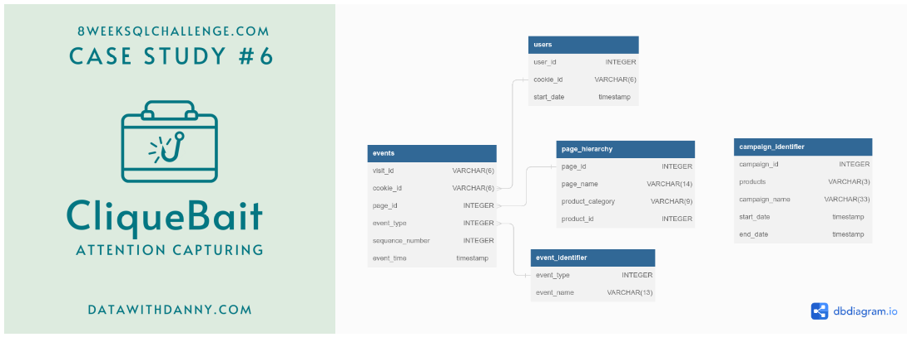
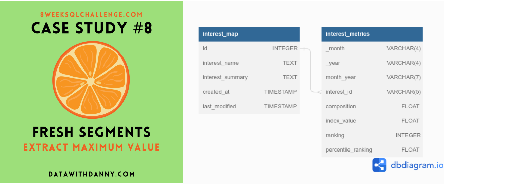

# Portfolio

---

## Computer vision

### Pleural effusion detection

 I tried to predict pleural effusion on MRI scans. 
This is an image segmentation problem. Project includes preprocessing data in special format used in medicine,  
training U-net for segmentation, tracking with Tensorboard. For quality measurements DICE metric was used.    
 
 
<b>Project includes</b>: 
 
 
<ul class="b">
    <li>Preprocessing input images</li>
    <li>Train Unet model with transfer learning for image segmentation</li>
    <li>Build web app with  Flask framework</li>
    <li>Perform model tests and analyse results with Tesnorboard</li>
</ul>

 

 

 

---
### Dog image classification Web app and Telegram bot

  Web application and Telegram bot for dog breed classification. 
In th project pre-trained Resnet50 was used for training,  Flask framework - for web application.    
Quality of the model prediction was measured by accuracy and confusion matrix.
 
 
<b>Project includes</b>: 
 
 
<ul class="b">
    <li>Create custom data class</li>
    <li>Train ResNet50 model for image classification with transfer learning</li>
    <li>Build web app with  Flask framework</li>
    <li>Deploy app with Docker</li>
    <li>Create Telegram bot for image classification</li>
</ul>

 
 

 

 

---

### Image-to-image: Convert photo to Monet-like painting

  Web application for converting photo images into Monet-like paintings using CycleGAN network.  
Gradio framework was used for web application.
 
 
<b>Project includes</b>: 
 
 
<ul class="b">
    <li>Create custom data class</li>
    <li>Build, train and tune CycleGAN neural network for style transfer</li>
    <li>Create web app using Gradio framework</li>
    <li>Deploy app with Docker</li>
</ul>

 
 

 

 ---

## Statistical analysis

### Advertising A/B testing

The company is trying new ad design to increase ad success. 
 To do so they made new creative advertising design with SmartAd brand and conduct an A/B test in which one group of users have been shown an old ad and another - new one.
 
 
<b>Project includes</b>: 
 
 
<ul class="b">
    <li>Analysis of data</li>
    <li>Fisher exact test</li>
    <li>Confidence interval calculation</li>
</ul>

---

## SQL

### SQL - Clique Bait

The goal of the project is to analyse and calculate funnal fallout rates for Clique Bait online seafood store.
 The project is based on 8weeksqlchallenge.com case.
 
 
<b>Project includes</b>: 
 
 
<ul class="b">
    <li>Setting up PostgresSQL server</li>
    <li>Creating project database and loading schemas with input tables</li>
    <li>Digit analysis</li>
    <li>Product funnel analysis</li>
    <li>Campaigns analysis</li>
</ul>

 ---

### SQL - Fresh Segments

Fresh Segments is a digital marketing agency that helps other businesses analyse trends in online ad click behaviour for their unique customer base.
The goal of the project is to analyse aggregated metrics for an example client and provide some high level insights about the customer list and their interests.
 The project is based on 8weeksqlchallenge.com case.
 
 
<b>Project includes</b>: 
 
 
<ul class="b">
    <li>Setting up PostgresSQL server</li>
    <li>Creating project database and loading schemas with input tables</li>
    <li>Data exploration and cleansing</li>
    <li>Interest analysis</li>
    <li>Segment analysis
    <li>Index analysis</li>
</ul>

