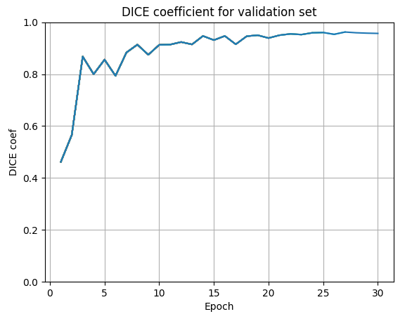

## Portfolio

---

### Computer vision

[View on GitHub](https://img.shields.io/badge/GitHub-View_on_GitHub-blue?logo=GitHub)](https://github.com/LtvnSergey/Pleural-Effusion-Detection)

 I tried to predict pleural effusion on MRI scans. This is an image segmentation problem. Project includes preprocessing data in special format used in medicine,  training U-net for segmentation, tracking with Tensorboard. For quality measurements DICE metric was used.    

 

 
 

 

---
[Project 2 Title](/pdf/sample_presentation.pdf)

---
[Project 3 Title](http://example.com/)

---

### Category Name 2

- [Project 1 Title](http://example.com/)
- [Project 2 Title](http://example.com/)
- [Project 3 Title](http://example.com/)
- [Project 4 Title](http://example.com/)
- [Project 5 Title](http://example.com/)

---

---
