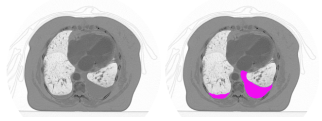

# Portfolio

---

## Computer vision

### Pleural effusion detection

 I tried to predict pleural effusion on MRI scans. 
This is an image segmentation problem. Project includes preprocessing data in special format used in medicine,  
training U-net for segmentation, tracking with Tensorboard. For quality measurements DICE metric was used.    

 

 

 

---
### Dog image classification Web app and Telegram bot

  Web application and Telegram bot for dog breed classification. 
In th project pre-trained Resnet50 was used for training,  Flask framework - for web application.    
Quality of the model prediction was measured by accuracy and confusion matrix.

 
 

 

 

---

### Image-to-image: Convert photo to Monet-like painting

  Web application for converting photo images into Monet-like paintings using CycleGAN network.  
Gradio framework was used for web application.

 
 

 

 ---

## Statistical analysis

### Advertising A/B testing

The company is trying new ad design to increase ad success. 
 To do so they made new creative advertising design with SmartAd brand and conduct an A/B test in which  one group of users have been shown an old ad and another - new one.

Project include: 
<ul class="b">
    <li>Analysis of data</li>
    <li>Fisher exact test</li>
    <li>Confidence interval calculation</li>
</ul>

